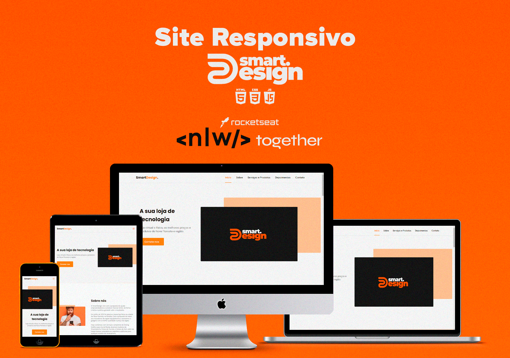

  <a href="#-tecnologias">Tecnologias</a>&nbsp;&nbsp;&nbsp;|&nbsp;&nbsp;&nbsp;
  <a href="#-projeto">Projeto</a>&nbsp;&nbsp;&nbsp;|&nbsp;&nbsp;&nbsp;
  <a href="#-layout">Layout</a>&nbsp;&nbsp;&nbsp;|&nbsp;&nbsp;&nbsp;
  <a href="#memo-licença">Licença</a>

 

  

 

  

## 🚀 Tecnologias

Esse projeto foi desenvolvido com as seguintes tecnologias:

- HTML
- CSS
- JavaScript

Bibliotecas

- [Google Fonts](https://fonts.google.com/)
- [SwipeJS](https://github.com/nolimits4web/Swiper)
- [ScrollRevel](https://scrollrevealjs.org)

Utilitários

- [IconMoon](https://icomoon.io/app/#/select)

## 💻 Projeto

O projeto foi desenvolvido de acordo com os conhecimentos repassados no NLW #6 Misson: Origin da Rocketseat. 

A SmartDesign é uma microempresa de tecnologia da região de Nova Floresta, Paraíba. A página é desenvolvida no formato One Page, totalemnte responsiva, pode ser visualizada em dispositivos pequenos (smartphones), médios (tablets) e grandes (computadores e notebooks). Contém as seguintes seções: Header, Navigation, Home, Sobre, Serviços e Produtos, Depoimentos, Contato e Footer.

Você pode visitar o site [clicando aqui](https://darllinsonazvd.github.io/smartdesign-site/)

## 🔖 Layout

Você pode visualizar o layout do projeto através [desse link](https://www.figma.com/file/c7S7R40rgorVtZHbvPUAyt/SmartDesign). É necessário ter conta no [Figma](https://figma.com) para acessá-lo.

## 📝 Licença

Esse projeto está sob a licença MIT. Veja o arquivo [LICENSE](github/LICENSE.md) para mais detalhes.
